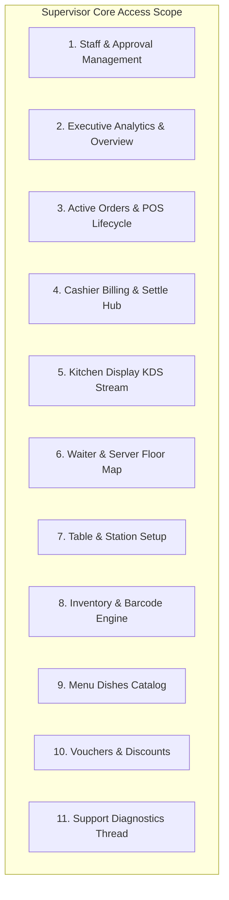

# Supervisor Role Access & Project Scope Specification
## রেস্তোরাঁ SaaS - সুপারভাইজার রোল অ্যাক্সেস ও প্রজেক্ট স্কোপ গাইড

---

## 📌 Executive Summary (সংক্ষিপ্ত বিবরণ)
রেস্তোরাঁ SaaS প্ল্যাটফর্মে **`SUPERVISOR`** রোলটি মূলত **রেস্তোরাঁর মালিক (Restaurant Owner) / প্রধান সুপারভাইজার** হিসেবে কাজ করে।
- **Tenant Scope (রেস্তোরাঁ বাউন্ডারি):** সুপারভাইজার শুধুমাত্র তার নিজস্ব রেস্তোরাঁর (`businessId`) ডাটা ও কার্যক্রম নিয়ন্ত্রণ করতে পারেন। অন্য কোনো রেস্তোরাঁর ডাটায় তার অ্যাক্সেস নেই।
- **Authority (কর্তৃত্ব):** রেস্তোরাঁর অভ্যন্তরীণ সকল অপারেশন (স্টাফ অনুমোদন, সেলস ড্যাশবোর্ড, পিওএস কাউন্টার, কিচেন কেডিএস, সার্ভার ফ্লোর, ইনভেন্টরি ও মেনু ক্যাটালগ) সুপারভাইজারের পূর্ণ নিয়ন্ত্রণে থাকে।

---

## 🏗️ Project Scope Wise Access Breakdown (প্রজেক্ট স্কোপ অনুযায়ী অ্যাক্সেস)

---

### 1. 👥 Staff & Access Approvals (স্টাফ ও অনুমোদন ব্যবস্থাপনা)
> **প্রজেক্ট স্কোপ:** রেস্তোরাঁর সকল কর্মচারীদের একাউন্ট তৈরি, অনুমোদন ও অ্যাক্সেস কন্ট্রোল।

| Feature / Action | Endpoint | HTTP Method | Supervisor Access | বিবরণ |
| :--- | :--- | :---: | :---: | :--- |
| **Get Approval Requests** | `/users/approvals` | `GET` | ✅ Full | পেন্ডিং, অ্যাপ্রুভড ও ব্লকড স্টাফ রিকোয়েস্ট ও KPI মেট্রিক্স দেখা |
| **Approve / Block Staff** | `/users/:id/approval` | `PATCH` | 🔒 **Exclusive** | স্টাফ বা ম্যানেজারের পিওএস লগইন অনুমোদন (Accept) বা ব্লক (Block) করা |
| **Add New Employee** | `/users` | `POST` | ✅ Full | নতুন ম্যানেজার, ক্যাশিয়ার, সার্ভার বা কিচেন স্টাফ একাউন্ট তৈরি |
| **Get All Employees** | `/users` | `GET` | ✅ Scoped | নিজস্ব রেস্তোরাঁর সকল কর্মচারীর তালিকা ও মাস্কড পিন দেখা |
| **Get Employee Details** | `/users/:id` | `GET` | ✅ Scoped | নির্দিষ্ট কর্মচারীর প্রোফাইল ও ডিপার্টমেন্ট দেখা |
| **Edit Employee Profile** | `/users/:id` | `PATCH` | ✅ Scoped | কর্মচারীর নাম, রোল বা স্ট্যাটাস পরিবর্তন |
| **Delete Employee** | `/users/:id` | `DELETE` | ✅ Scoped | কর্মচারী একাউন্ট স্থায়ীভাবে মুছে ফেলা |
| **Update Quick PIN** | `/users/:id/change-pin` | `POST` | ✅ Scoped | কর্মচারীর ৪-ডিজিটের কুইক লগইন পিন আপডেট/রিসেট করা |

---

### 2. 📊 Executive Overview & Sales Metrics (সেলস ও রেভিনিউ ড্যাশবোর্ড)
> **প্রজেক্ট স্কোপ:** রেস্তোরাঁর লাইভ ব্যবসায়িক পারফরম্যান্স ও রেভিনিউ পর্যবেক্ষণ।

| Feature / Action | Endpoint | HTTP Method | Supervisor Access | বিবরণ |
| :--- | :--- | :---: | :---: | :--- |
| **Get Daily Overview KPIs** | `/overview` or `/overview/cards` | `GET` | ✅ Full | Daily Sales, Total Transactions, Active Terminals, Pending Orders দেখা |
| **Manager Tenant Metrics** | `/businesses/manager-overview` | `GET` | ✅ Full | রেস্তোরাঁ টেন্যান্টের সমন্বিত পারফরম্যান্স ও টার্মিনাল স্ট্যাটাস |

---

### 3. 🍽️ Food Orders & Order Lifecycle (খাবারের অর্ডার ও লাইফসাইকেল)
> **প্রজেক্ট স্কোপ:** ডাইন-ইন ও টেকঅ্যাওয়ে অর্ডারের শুরু থেকে পেমেন্ট পর্যন্ত লাইফসাইকেল ট্র্যাকিং।

| Feature / Action | Endpoint | HTTP Method | Supervisor Access | বিবরণ |
| :--- | :--- | :---: | :---: | :--- |
| **Create New Order** | `/orders` | `POST` | ✅ Full | টেবিল অথবা টেকঅ্যাওয়ের জন্য নতুন অর্ডার তৈরি |
| **Get Active & History Orders** | `/orders` | `GET` | ✅ Full | স্ট্যাটাস ফিল্টার (Pending, Preparing, Served, Completed) অনুযায়ী অর্ডার দেখা |
| **Get Order Metrics** | `/orders/summary` | `GET` | ✅ Full | স্ট্যাটাস ভিত্তিক অর্ডারের মোট সংখ্যা ও সারাংশ |
| **Get Single Order Details** | `/orders/:id` | `GET` | ✅ Full | অর্ডারের আইটেম লিস্ট, টেবিল টোকেন ও বিল দেখা |
| **Update Order Status** | `/orders/:id/status` | `PATCH` | ✅ Full | স্টেজ ট্রানজিশন: `PENDING` ➔ `PREPARING` ➔ `SERVED` ➔ `COMPLETED` |
| **Edit Order Details** | `/orders/:id` | `PATCH` | ✅ Full | অর্ডারের আইটেম পরিবর্তন বা পরিমাণ আপডেট |
| **Cancel & Delete Order** | `/orders/:id` | `DELETE` | ✅ Full | ভুল বা বাতিল হওয়া অর্ডার ডিলিট করা |

---

### 4. 💳 Cashier POS Hub & Billing Checkout (ক্যাশ কাউন্টার ও বিলিং)
> **প্রজেক্ট স্কোপ:** ক্যাশিয়ার কাউন্টার গ্রিড, টেবিল বিলিং ও মাল্টি-পেমেন্ট সেটেলমেন্ট।

| Feature / Action | Endpoint | HTTP Method | Supervisor Access | বিবরণ |
| :--- | :--- | :---: | :---: | :--- |
| **Get Live Table Billing Grid** | `/cashier/tables` | `GET` | ✅ Full | টেবিল ও বার স্টেশনের রিয়েল-টাইম বিল এবং অকুপেন্সি গ্রিড |
| **Get Cashier Order Menu** | `/cashier/menu` | `GET` | ✅ Full | কাউন্টার থেকে দ্রুত আইটেম সিলেক্ট করার মেনু |
| **Get Table Bill Details** | `/cashier/tables/:tableId/bill` | `GET` | ✅ Full | নির্দিষ্ট টেবিলের সাবটোটাল ও আইটেম বিল ব্রেকডাউন |
| **Complete Bill Checkout** | `/cashier/checkout` | `POST` | ✅ Full | **Cash**, **Card** (Visa/Mastercard), এবং **MFS** (bKash, Nagad, Rocket, Upay) সেটেলমেন্ট |

---

### 5. 👨‍🍳 Kitchen Display System - KDS (কিচেন প্রোডাকশন ও টিকেট)
> **প্রজেক্ট স্কোপ:** কিচেনের লাইভ প্রোডাকশন স্পিড ও কুকিং স্টেশনের টিকেট পরিচালনা।

| Feature / Action | Endpoint | HTTP Method | Supervisor Access | বিবরণ |
| :--- | :--- | :---: | :---: | :--- |
| **Kitchen Summary KPIs** | `/kitchen/summary` | `GET` | ✅ Full | Completed Today, Avg Prep Time, এবং Station Capacity লোড দেখা |
| **Live Tickets Stream** | `/kitchen/tickets` | `GET` | ✅ Full | টেবিল টোকেন ও মডিফায়ার সহ কিচেনের লাইভ রান্নার টিকেট |
| **Bump Ticket Stage** | `/kitchen/tickets/:id/bump` | `PATCH` | ✅ Full | টিকেট স্টেজ আপডেট (`PREPARING` ➔ `READY` ➔ `COMPLETED`) |
| **Create Kitchen Ticket** | `/kitchen/tickets` | `POST` | ✅ Full | কিচেন ডিসপ্লেতে ম্যানুয়াল টিকেট পাঠানো |

---

### 6. 🚶‍♂️ Waiter & Floor Operations (সার্ভিস ও ওয়েটার ফ্লোর)
> **প্রজেক্ট স্কোপ:** ডাইনিং ফ্লোরের টেবিল ম্যাপ, সার্ভিস রিকোয়েস্ট ও ইনস্ট্যান্ট কিচেন অর্ডার।

| Feature / Action | Endpoint | HTTP Method | Supervisor Access | বিবরণ |
| :--- | :--- | :---: | :---: | :--- |
| **Get Floor Table Map** | `/serve/tables` | `GET` | ✅ Full | রিয়েল-টাইম টেবিল অকুপেন্সি ও কালার ব্যাজ ম্যাপ |
| **Update Table Status** | `/serve/tables/:id/status` | `PATCH` | ✅ Full | ফ্লোর ম্যাপ থেকে টেবিল স্ট্যাটাস (`AVAILABLE`, `OCCUPIED`, `RESERVED`) পরিবর্তন |
| **Send Order to Kitchen** | `/serve/orders` | `POST` | ✅ Full | ডায়েটারি ট্যাগ সহ খাবার সরাসরি কিচেনে পুশ করা |
| **Get Table Order Statuses** | `/serve/orders` | `GET` | ✅ Full | ওয়েটার টিকেট ও সার্ভিং স্ট্যাটাস ট্র্যাক করা |
| **Update Serve Stage** | `/serve/orders/:id/status` | `PATCH` | ✅ Full | খাবার সার্ভড হয়েছে হিসেবে মার্ক করা |

---

### 7. 🪑 Table & Floor Stations Configuration (টেবিল ও ফ্লোর জোন)
> **প্রজেক্ট স্কোপ:** রেস্তোরাঁর ফ্লোর প্ল্যান, সিটিং ক্যাপাসিটি ও জোন সেটআপ।

| Feature / Action | Endpoint | HTTP Method | Supervisor Access | বিবরণ |
| :--- | :--- | :---: | :---: | :--- |
| **Add New Floor Table** | `/tables` | `POST` | ✅ Full | ক্যাপাসিটি, সেকশন ও জোন দিয়ে নতুন টেবিল যুক্ত করা |
| **Get All Floor Tables** | `/tables` | `GET` | ✅ Full | টেবিল লিস্ট এবং স্ট্যাটাস ফিল্টার |
| **Get Table Metrics** | `/tables/summary` | `GET` | ✅ Full | মোট, অকুপাইড, অ্যাভেইলেবল এবং রিজার্ভড টেবিল সংখ্যা |
| **Update Table Setup** | `/tables/:id` | `PATCH` | ✅ Full | টেবিল ক্যাপাসিটি, জোন বা স্ট্যাটাস এডিট করা |
| **Delete Floor Table** | `/tables/:id` | `DELETE` | ✅ Full | ফ্লোর টেবিল মুছে ফেলা |

---

### 8. 📦 Inventory, Stock & Barcode Engine (ইনভেন্টরি ও বারকোড)
> **প্রজেক্ট স্কোপ:** কাঁচামাল/পণ্য ইনভেন্টরি, বারকোড/QR স্ক্যানিং এবং স্টক অ্যাডজাস্টমেন্ট।

| Feature / Action | Endpoint | HTTP Method | Supervisor Access | বিবরণ |
| :--- | :--- | :---: | :---: | :--- |
| **Add New Product** | `/products` | `POST` | ✅ Full | ইনভেন্টরিতে নতুন পণ্য যুক্ত করা (অটো বারকোড সহ) |
| **Get All Products** | `/products` | `GET` | ✅ Full | পেজিনেশন, সার্চ ও স্টক ফিল্টার সহ পণ্যের তালিকা |
| **Inventory Summary KPIs** | `/products/summary` | `GET` | ✅ Full | ইন-স্টক, লো-স্টক, আউট-অফ-স্টক এবং মোট ইনভেন্টরি ভ্যালুয়েশন |
| **Auto Generate SKU** | `/products/generate-sku` | `GET` | ✅ Full | নতুন আইটেমের জন্য ইউনিক বারকোড/SKU জেনারেট করা |
| **Scan Barcode / QR** | `/products/scan`, `/products/scan/:code` | `GET`/`POST` | ✅ Full | বারকোড বা QR কোড স্ক্যান করে লাইভ স্টক ও দাম যাচাই |
| **Print Barcode Label** | `/products/:id/barcode-label` | `GET` | ✅ Full | থার্মাল ও স্টিকার প্রিন্টারের জন্য বারকোড লেবেল ডাটা |
| **Edit Product** | `/products/:id` | `PATCH` | ✅ Full | পণ্যের নাম, ক্যাটাগরি, মূল্য বা সক্রিয় স্ট্যাটাস আপডেট |
| **Adjust Stock Level** | `/products/:id/stock` | `PATCH` | ✅ Full | স্টক বাড়ানো (`ADD`), কমানো (`SUBTRACT`), বা নির্দিষ্ট মান সেট (`SET`) করা |

---

### 9. 📋 Food Menu Catalog (খাবারের মেনু ক্যাটালগ)
> **প্রজেক্ট স্কোপ:** রেস্তোরাঁর ফুড মেনু আইটেম, ক্যাটাগরি ও স্টক অ্যাভেইলেবিলিটি।

| Feature / Action | Endpoint | HTTP Method | Supervisor Access | বিবরণ |
| :--- | :--- | :---: | :---: | :--- |
| **Add New Menu Dish** | `/menu-items` | `POST` | ✅ Full | মেনুতে নতুন খাবার আইটেম যুক্ত করা |
| **Get Menu Catalog** | `/menu-items` | `GET` | ✅ Full | মেনু আইটেম তালিকা, ক্যাটাগরি ফিল্টার ও সার্চ |
| **Get Menu Categories** | `/menu-items/categories` | `GET` | ✅ Full | ক্যাটাগরি লিস্ট এবং আইটেম কাউন্ট |
| **Update Menu Dish** | `/menu-items/:id` | `PATCH` | ✅ Full | খাবারের নাম, ডেসক্রিপশন, ছবি ও মূল্য আপডেট |
| **Toggle Availability** | `/menu-items/:id/toggle-availability` | `PATCH` | ✅ Full | খাবার ইন-স্টক বা আউট-অফ-স্টক টগল করা |
| **Delete Menu Dish** | `/menu-items/:id` | `DELETE` | ✅ Full | মেনু থেকে খাবার মুছে ফেলা |

---

### 10. 🏷️ Vouchers & Promotions (ভাউচার ও ডিসকাউন্ট)
> **প্রজেক্ট স্কোপ:** কাস্টমার ডিসকাউন্ট কোড ও স্পেশাল অফার তৈরি।

| Feature / Action | Endpoint | HTTP Method | Supervisor Access | বিবরণ |
| :--- | :--- | :---: | :---: | :--- |
| **Create Discount Voucher** | `/vouchers` | `POST` | ✅ Full | ডিসকাউন্ট পারসেন্টেজ ও শর্ত সহ ভাউচার তৈরি |
| **Get All Vouchers** | `/vouchers` | `GET` | ✅ Full | রেস্তোরাঁর সকল সক্রিয় ডিসকাউন্ট ভাউচার দেখা |
| **Get Single Voucher** | `/vouchers/:id` | `GET` | ✅ Full | নির্দিষ্ট ভাউচারের শর্তাবলী ও ডিসকাউন্ট বিস্তারিত |
| **Edit Voucher** | `/vouchers/:id` | `PATCH` | ✅ Full | ভাউচারের নাম, কোড বা অফ প্রাইস পরিবর্তন |

---

### 11. 🎫 Support Tickets & Diagnostics (সাপোর্ট টিকেট ও ডায়াগনস্টিকস)
> **প্রজেক্ট স্কোপ:** টেকনিক্যাল সমস্যা হলে সুপার অ্যাডমিন টিমের সাথে লাইভ যোগাযোগ।

| Feature / Action | Endpoint | HTTP Method | Supervisor Access | বিবরণ |
| :--- | :--- | :---: | :---: | :--- |
| **Submit Support Ticket** | `/tickets` | `POST` | ✅ Full | সিঙ্ক সমস্যা, প্রিন্টার বা পেমেন্ট ত্রুটি সাবমিট করা |
| **Get Ticket History** | `/tickets` | `GET` | ✅ Full | রেস্তোরাঁর সকল প্রিভিয়াস টিকেটের স্ট্যাটাস দেখা |
| **Get Ticket Chat Thread** | `/tickets/:id` | `GET` | ✅ Full | টিকেট বিস্তারিত ও ডায়াগনস্টিক মেট্রিক্স দেখা |
| **Live Chat with Admin** | `/tickets/:id/messages` | `POST` | ✅ Full | টিকেটের ভেতরে অ্যাডমিনের সাথে মেসেজ আদান-প্রদান |

---

## 🚫 Restricted Scopes for Supervisor (যা সুপারভাইজারের আওতাভুক্ত নয়)
সুপারভাইজার শুধুমাত্র তার নির্দিষ্ট রেস্তোরাঁর সীমানায় কাজ করেন। নিচের গ্লোবাল প্ল্যাটফর্ম ফিচারগুলো শুধুমাত্র **`SUPER_ADMIN`** এর জন্য সংরক্ষিত:

1. **অন্য রেস্তোরাঁ রেজিস্ট্রেশন বা ডিলিট:** (`POST /businesses`, `DELETE /businesses/:id`)
2. **গ্লোবাল সাবস্ক্রিপশন প্ল্যান কনফিগারেশন:** (`/subscription-plans/*`, `PATCH /businesses/:id/subscription-plan`)
3. **গ্লোবাল টেন্যান্ট অ্যাডমিন ড্যাশবোর্ড:** (`GET /businesses/admin-overview`, `GET /businesses`)
4. **সিস্টেম-ওয়াইড রোল পারমিশন এনেবল/ডিজেবল:** (`PATCH /businesses/:businessId/roles`)
5. **সুপার অ্যাডমিন টিকেট স্ট্যাটাস ফোর্স ক্লোজ:** (`PATCH /tickets/:id/status`, `DELETE /tickets/:id`)

---

## 🔐 Security & Data Isolation Architecture (সিকিউরিটি ও টেন্যান্ট আইসোলেশন)
- **JWT Authentication (`JwtAuthGuard`):** প্রতিটি রিকোয়েস্টে `Bearer <token>` যাচাই করা হয়।
- **Role Guard (`RolesGuard`):** কন্ট্রোলারের `@Roles()` ডেকোরেটর নিশ্চিত করে যে `SUPERVISOR` তার অনুমোদিত এন্ডপয়েন্ট ছাড়া অন্য কিছু অ্যাক্সেস করতে পারবে না।
- **Tenant Scoping (`getEffectiveBusinessId`):** ডাটাবেজের প্রতিটি কুয়েরি ব্যবহারকারীর নিজস্ব `user.businessId` দ্বারা ফিল্টার করা হয়।
- **PIN Encryption:** ৪-ডিজিটের কুইক লগইন পিন এবং পাসওয়ার্ড `bcrypt` দিয়ে হ্যাশ করে নিরাপদে ডাটাবেজে রাখা হয়।
